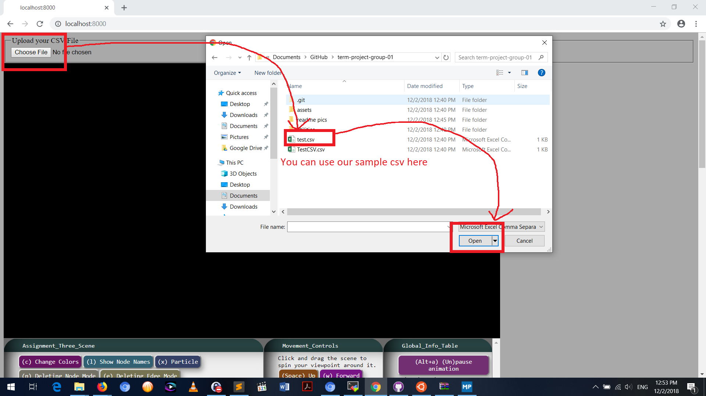
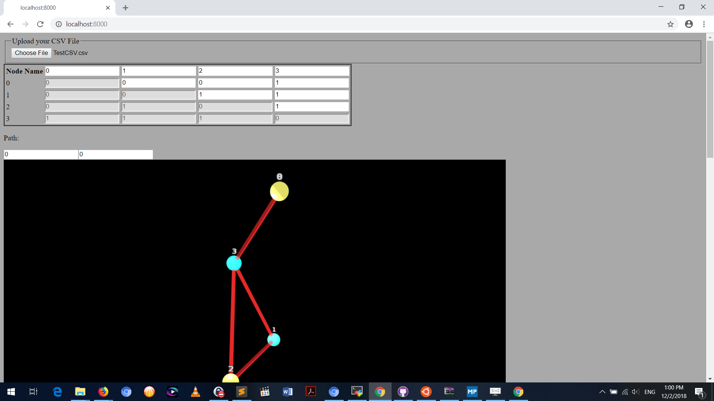
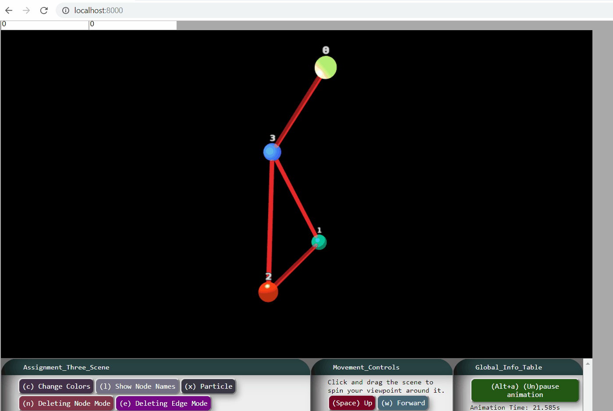
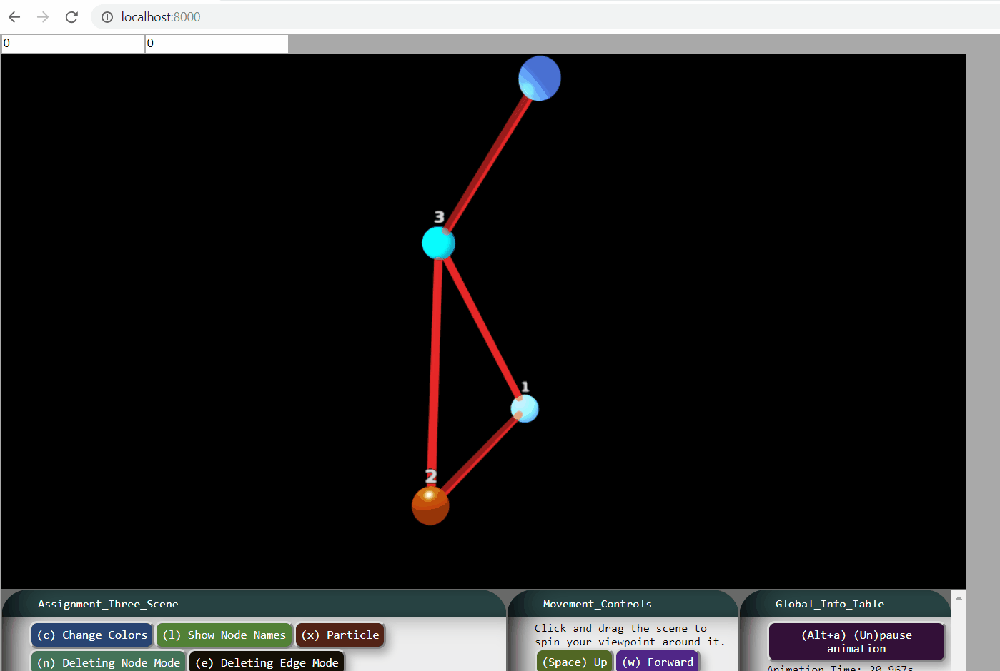
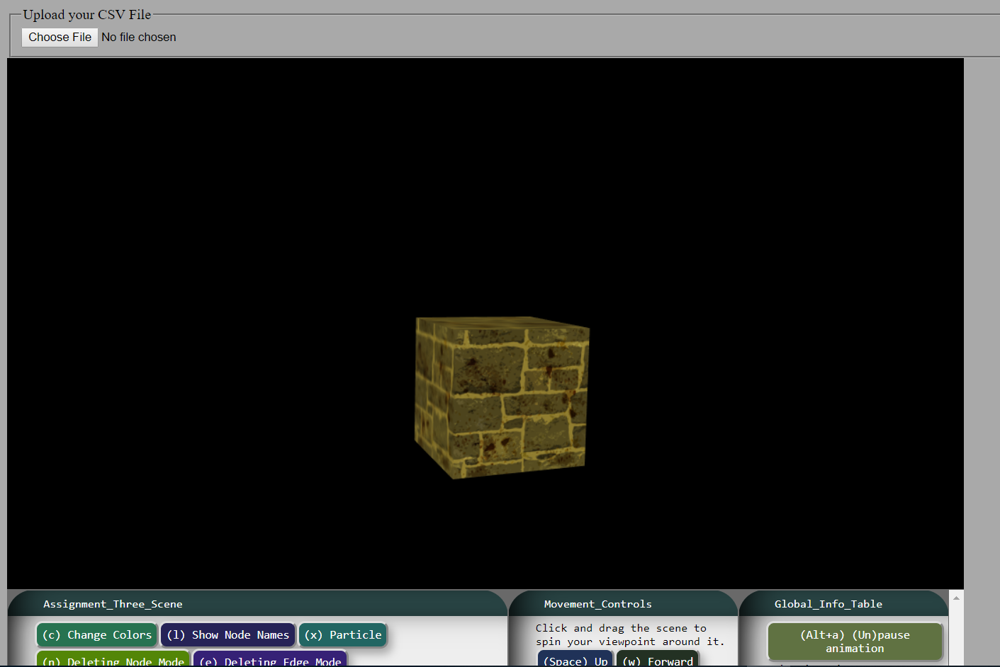
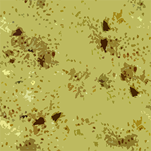
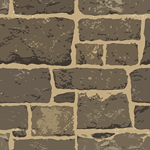

# Graph Visualizer

Our project takes an adjacency matrix from a CSV file and processes it such that all of the nodes and edges can be properly visualized in 3D-space. Each node has a unique color and label so that the user can properly identify the corresponding nodes from the adjacency matrix. The label and color can be changed at the user's discretion using the table above the canvas. The user can interact with the graph in three distinct ways. 

## How to Run It

To run the program, click the "Choose File" button to attach a CSV file. There are sample CSV files provided in the repository. The CSV file should be in the format of an adjacency matrix. To access the features, a CSV needs to be uploaded. You may need to zoom out by pressing "s" to see the whole graph.

You should see something like this (remember to zoom out by pressing "s" if you can't see the whole graph):

For the Node Deletion feature, press (n) or click the button on the window below the canvas. Afterwards, one should notice the labels disappearing. Simply click the desired node to be removed.

For the Edge Deletion feature, press (e) or click the button on the window below the canvas. Aftewards, one should notice that all the nodes turns a solid blue and the edges turn into unique colors. This is to directly alert the user that the nodes are to not be clicked and so that the user can uniquely identify the edges.

Lastly, the shortest path mode can be implemented by typing to values into the Path fields. Click away from the fields and then turn on the particle mode to see the animated pathway. Note that two modes cannot be activated at the same time and a flag in the CONSOLE will be displayed if a user attempts to turn on multiple nodes at the same time. 

## Node Deletion

The user specifically turns on a mode such that when clicking on a node, it will be removed from the canvas. While in this mode, the user cannot delete any edges. In addition, any changes to the nodes will be properly represented in the table above the canvas.

## Edge Deletion

The user specifically turns on a mode such that when clicking on an edge, it will be removed from the canvas. While in this mode, the user cannot delete any nodes and the colors of the edges will all be unique so that the user can properly identify which edge they want to delete. In addition, any changes to the edges will be properly represented in the table above the canvas.

## Shortest Path Visualization

The user inputs two nodes into a form. Afterwards, if "Particle" mode is activated, an animation appears that shows particles moving between the nodes and along the edges that formed the path. 

## Advanced Features

**Picking**: Picking was implemented for the node and edge deleting features. The user can click on the nodes and edges in which the application can properly identify which node or edge to remove. After the program identifies the proper object, the changes will be reflected in the canvas and the table.

**Collision Detection**: Collision Detection was implemented for the shortest path visualization. The movement of the hundreds of particles are restrained within bounded volumes (like an ideal gas). If the particles are in the nodes, they are restrained within a sphere and if the particles are in an edge they are restrained within a cylinder. Any collision between the particle and a boundary results in the particle moving in a reasonable random direction that keeps it within the boundary. 

# Part Allocation

Shen Teng did the particle effect for the shortest path visualization using collision detection. He created the HTML elements for the user to interact with the software. He also organized the code and helped the other group members debug areas of their code. He also incorporated the D3-force-3d library into the application.

Edward Nguyen created the functions that took the coordinates of the nodes and the adjacency matrix to create the transformation matrices which properly placed the objects in the canvas. Also, he worked on the picking feature, implementing the node and edge deletion modes. He also wrote the function to interpret the CSV file.

Chiao Lu implemented Dijkstra's algorithm, converted the adjacency matrix to nodes and links, and collaborated with Edward on implementing the picking nodes. He also researched and found the D3-force-3d library for the group to use to find the coordinates of the nodes. 

All three members worked on developing the algorithms for the collision detection and the transformation of the objects to place them properly on the canvas. 

All three members tried to implement the bump mapping within Garret's framework. However, the group only succeeded in applying two textures to an object and passing variables into the GLSL code but could not progress on implementing the remaining parts. See below for the completed work.

# Loading Multiple Textures into Garret Framework

